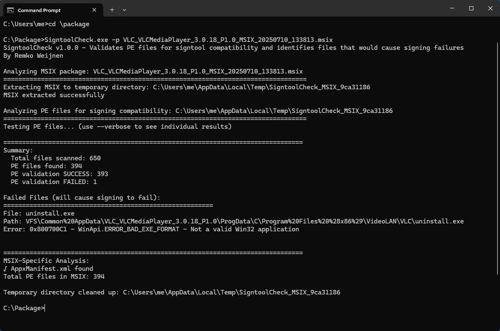

# SigntoolCheck
Tool that validates and optionally fixes files that prevent signing (MSIX) files with signtool

I had a Deja-Vu today as I was trying to generate an MSIX for a package I got the dreaded `0x800700C1` better known as [ERROR_BAD_EXE_FORMAT](https://www.magnumdb.com/search?q=0x800700C1) error from signtool:

```
SignTool Error: SignedCode::Sign returned error: 0x800700C1
        For more information, please see https://aka.ms/badexeformat
SignTool Error: An error occurred while attempting to sign: MSIXConverter\output\VLC_VLCMediaPlayer_3.0.18_P1.0_MSIX_20250710_120822.msix
```

The cause of the error is quite clear: there is an executable (which might also be a dll) that it was unable to sign, probably because it's somehow corrupted.
Unfortunately even when using the `/v` (verbose) and/or the `/debug` flag signtool doesn't tell us what file(s) it's having an issue with.

Why the Deja-Vu? I wrote about this earlier: [SignTool Sign Returns Error 0x800700C1](https://web.archive.org/web/20240511004903/https://www.remkoweijnen.nl/blog/2018/01/19/signtool-sign-returns-error-0x800700c1/).
Sidenote: yes I need to restore my old blog someday but haven't got round to it yet, so for now you'll have to use the web archive link.

I was pretty sure the cause would be the same as last time, a corrupted Security Directory in on the files.

But my package contained 648 files so I really didn't want to manually check them all...

** What I did **
I tried to run Procmon with the idea that the last file it accessed in my package would be the offending one but unfortunately Signtool extracts the MSIX (which is really a zip) but uses random filenames.
Then I tried to match the file by filesize, this pointed to vlc.exe but unfortunately that gave the wrong file (vlc.exe) as I removed it for testing and the error remained.

My next step was to run Signtool with (brilliant!) [Api Monitor](http://www.rohitab.com/apimonitor) tool but Signtool immediately exits on my machine with Signtool.

So I decided to load Signtool.exe in my trusted Ida Pro and followed the disassembly, starting with `Signtool::Sign` as thas was in the stacktrace from Procmon.

This led me to the various signing and hashing api's that signtool uses and then it was a matter of finding the one that returns `0x800700C1`.

Once I found that - I could replicate that bit of signtool so I wrote a tool that recursively runs through a folder, identifies Windows PE files, and scans them to see if they would return `ERROR_BAD_EXE_FORMAT`.

And - probably not a coicidence - the culprit was again `uninstall.exe`:



If you want to use this tool, you can fetch the binary from Releases.
It can be used to scan a single file, a folder recursively or an MSIX file.

AND it can fix a binary that has an issue with the Security Directory using the `-- fix` switch.
```
SigntoolCheck v1.0.0 - Validates PE files for signtool compatibility and identifies files that would cause signing failures
By Remko Weijnen


  -p, --path       Required. Path to file, directory, or MSIX package to analyze
  -o, --output     Output file path (for fix mode)
  -f, --fix        (Default: false) Fix PE security directory issues
  -v, --verbose    (Default: false) Show detailed output
  --help           Display this help screen.
  --version        Display version information.

Examples:
  Analyze a directory:
    SigntoolCheck -p C:\MyApp
    SigntoolCheck -p C:\MyApp -v

  Analyze a single file:
    SigntoolCheck -p C:\MyApp\app.exe

  Analyze an MSIX package:
    SigntoolCheck -p package.msix

  Fix PE security directory:
    SigntoolCheck -p broken.exe -o fixed.exe -f
```
